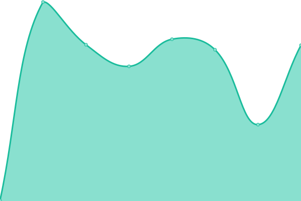
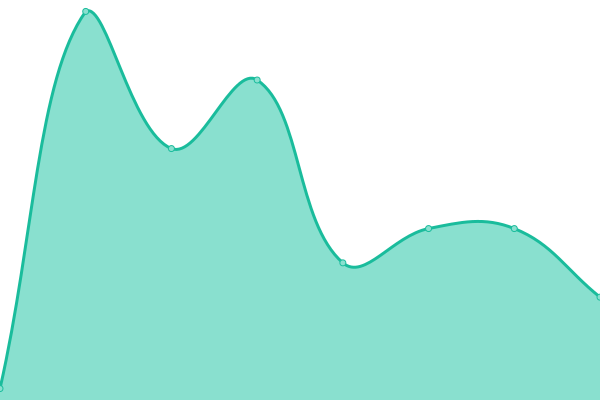

# [📈 Live Status](https://status.slymetrics.com): <!--live status--> **🟧 Partial outage**

This repository contains the open-source uptime monitor and status page for [davidrandulfe](https://status.slymetrics.com), powered by [Upptime](https://github.com/upptime/upptime).

With [Upptime](https://upptime.js.org), you can get your own unlimited and free uptime monitor and status page, powered entirely by a GitHub repository. We use [Issues](https://github.com/davidrandulfe/slymetrics-status/issues) as incident reports, [Actions](https://github.com/davidrandulfe/slymetrics-status/actions) as uptime monitors, and [Pages](https://status.slymetrics.com) for the status page.

<!--start: status pages-->
<!-- This summary is generated by Upptime (https://github.com/upptime/upptime) -->
<!-- Do not edit this manually, your changes will be overwritten -->
<!-- prettier-ignore -->
| URL | Status | History | Response Time | Uptime |
| --- | ------ | ------- | ------------- | ------ |
|  [SlyMetrics App](https://slymetrics.com) | 🟩 Up | [sly-metrics-app.yml](https://github.com/davidrandulfe/slymetrics-status/commits/HEAD/history/sly-metrics-app.yml) | 

 947ms
     
 | 

<a href="https://status.slymetrics.com/history/sly-metrics-app">100.00%</a>
    

|  [Webhook Proxy](https://webhooks.slymetrics.com) | 🟥 Down | [webhook-proxy.yml](https://github.com/davidrandulfe/slymetrics-status/commits/HEAD/history/webhook-proxy.yml) | 

 126ms
     
 | 

<a href="https://status.slymetrics.com/history/webhook-proxy">0.00%</a>
    

|  [Webhook Leads](https://tnbsttlqzpbrfofdhhoq.supabase.co/functions/v1/webhook-leads) | 🟩 Up | [webhook-leads.yml](https://github.com/davidrandulfe/slymetrics-status/commits/HEAD/history/webhook-leads.yml) | 

 255ms
     
 | 

<a href="https://status.slymetrics.com/history/webhook-leads">100.00%</a>
    

|  [Webhook Calls](https://tnbsttlqzpbrfofdhhoq.supabase.co/functions/v1/webhook-calls) | 🟩 Up | [webhook-calls.yml](https://github.com/davidrandulfe/slymetrics-status/commits/HEAD/history/webhook-calls.yml) | 

 177ms
     
 | 

<a href="https://status.slymetrics.com/history/webhook-calls">100.00%</a>
    

|  [Webhook Sales](https://tnbsttlqzpbrfofdhhoq.supabase.co/functions/v1/webhook-sales) | 🟩 Up | [webhook-sales.yml](https://github.com/davidrandulfe/slymetrics-status/commits/HEAD/history/webhook-sales.yml) | 

 178ms
     
 | 

<a href="https://status.slymetrics.com/history/webhook-sales">100.00%</a>
    

|  [Supabase Database](https://tnbsttlqzpbrfofdhhoq.supabase.co/rest/v1/) | 🟥 Down | [supabase-database.yml](https://github.com/davidrandulfe/slymetrics-status/commits/HEAD/history/supabase-database.yml) | 

 17ms
     
 | 

<a href="https://status.slymetrics.com/history/supabase-database">0.00%</a>
    

<!--end: status pages-->

[**Visit our status website →**](https://status.slymetrics.com)

## 📄 License

- Powered by: [Upptime](https://github.com/upptime/upptime)
- Code: [MIT](./LICENSE) © [Anand Chowdhary](https://anandchowdhary.com), supported by [Pabio](https://pabio.com)
- Data in the `./history` directory: [Open Database License](https://opendatacommons.org/licenses/odbl/1-0/)
